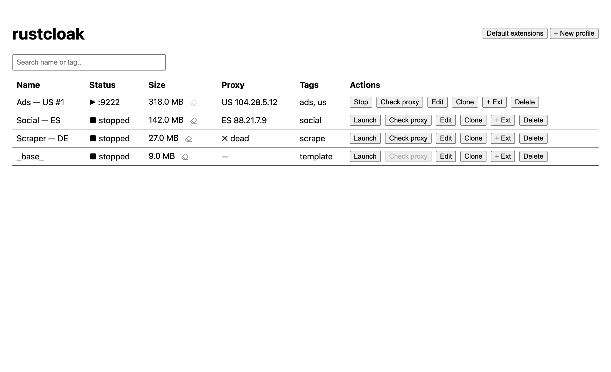
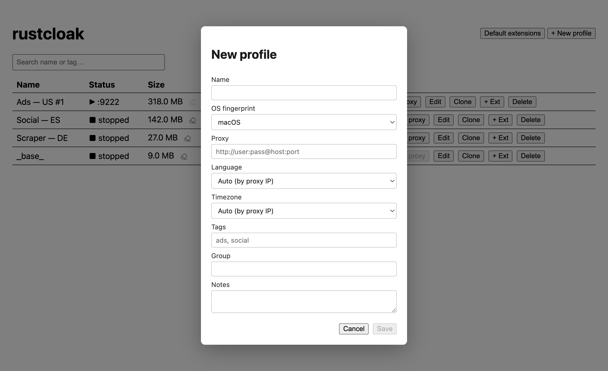
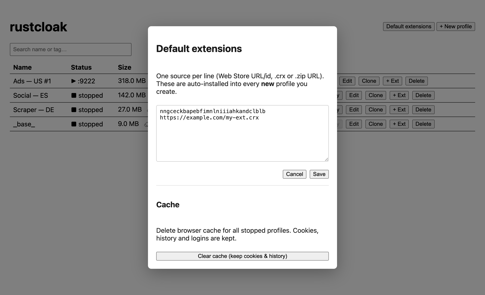

# rustcloak

A small **Rust + Tauri** desktop app to manage many isolated, fingerprint-distinct
browser profiles on top of the [CloakBrowser](https://github.com/CloakHQ/CloakBrowser)
engine. Think a lightweight AdsPower / Dolphin-style launcher.

> Not affiliated with CloakHQ. rustcloak orchestrates the CloakBrowser binary — it
> does **not** bundle or redistribute it (the engine is downloaded from the official
> source on first run).

## Screenshots



| New profile | Default extensions & cache |
|---|---|
|  |  |

<sub>Screenshots use sample data, not real profiles.</sub>

## Features
- **Isolated profiles** — each with its own user-data-dir, fingerprint seed and proxy.
- **One-click engine setup** — downloads the official CloakBrowser build, verifies
  the SHA-256, extracts it; daily update check.
- **Auto geo by exit IP** — timezone & locale matched to the proxy's (or direct)
  exit IP, or set manually from a searchable list.
- **Clone profiles** — fresh fingerprint per clone, while keeping extension logins
  (stable extension IDs via injected `manifest.key`).
- **Proxy per profile** + live check, tags/groups/search, per-profile size & cache
  cleanup (keeps cookies & history), bulk default-extensions.
- **Manual or automated** — open windows by hand, or drive each profile over CDP.

## Requirements
- macOS (Apple Silicon or Intel)
- [Rust](https://rustup.rs) (stable) and Node.js + npm
- The CloakBrowser engine — the app downloads it for you on first launch
  (~150 MB), or point it at an existing binary.

## Build & run
```bash
git clone https://github.com/izzipizzy/rustcloak.git
cd rustcloak
npm install

# dev (hot reload)
npm run tauri dev

# release build → src-tauri/target/release/bundle/macos/rustcloak.app
npm run tauri build
```

Run the core tests:
```bash
cargo test -p rustcloak_core
```

## Data location
Profiles, the SQLite metadata DB and the engine live under a single data dir
(sync it however you like). In dev builds it's `./data`; override with:
```bash
RUSTCLOAK_DATA_DIR=/path/to/data npm run tauri dev
```

## How it works
The Rust core (`crates/core`) is pure, unit-tested logic: profile store (SQLite),
launch-arg builder, proxy/geo resolver, CRX handling, clone, engine downloader.
`src-tauri` exposes it as Tauri commands; the Svelte UI drives them. Each launch
spawns the CloakBrowser binary with the right flags
(`--fingerprint`, `--proxy-server`, `--fingerprint-timezone`,
`--lang` / `--accept-lang` / `--fingerprint-locale`, `--load-extension`, …) and a
`--remote-debugging-port` for CDP automation.

## Notes
- The macOS engine build has fewer fingerprint patches than Linux/Windows; strict
  detectors (CreepJS / pixelscan) may flag more on macOS.
- macOS Gatekeeper blocks the ad-hoc-signed engine on first launch — approve once
  in System Settings → Privacy & Security.

## License
MIT for this app's code. The CloakBrowser engine is separate and **not** included
(license: free to use, no redistribution).
